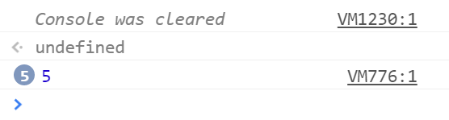

# Global var

### Problem

Suppose you have a web page that contains a `button` with the id `click-me`.

```
var button = document.getElementById('click-me');

for (var i = 0; i < 5; i += 1) {
  button.addEventListener('click', function () {
    console.log(i);
  })
}
```

1. What happens when you click the button? There are two pieces of behavior to explain—be sure you touch on both of them.

2. Explain why the button behaves this way.

* **Prompt/Hint**: What do the numbers next to the log statement indicate?

  * **Ask If** Ask this question if the student's console appears as in the image below.



_The console condenses messages that have been logged multiple times._

* **Prompt**: What would you expect each handler to log? Why does each handler log the value that it does?

- - -

### Copyright

Coding Boot Camp © 2016. All Rights Reserved.
