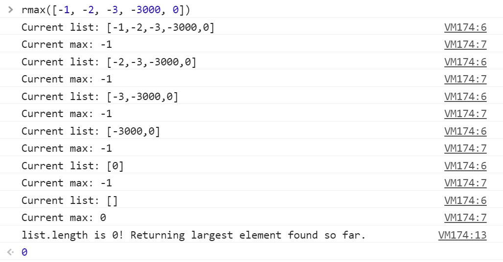

# Recursive Max Element

### Problem

Write a recursive function that finds the maximum element in a list.

* **Prompt**: How can we keep track of the biggest element we've seen so far?

* **Prompt**: When do we stop the recursion?

### Notes

Encouraged to _write out_ what the function does on each iteration. The image below is `console.log` output from a correct implementation.

_The rmax function at work._

- - -

### Copyright

Coding Boot Camp © 2016. All Rights Reserved.
